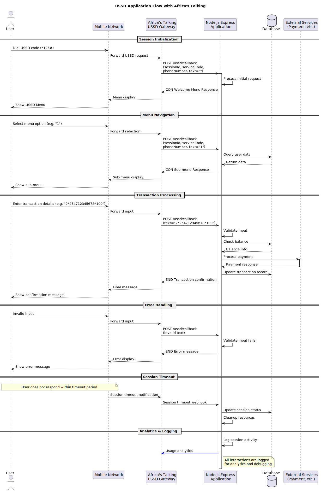

# USSD Application with Africa's Talking

This application is an example of a USSD service using Africa's Talking, developed with Node.js, Express, and TypeScript. The service simulates a simple mobile banking application allowing users to check their balance, send money, and buy airtime.

## Features

- Interactive USSD menu
- Balance checking
- Money transfer
- Airtime purchase
- Integration with [Africa's Talking API](https://africastalking.com/)

## Prerequisites

- Node.js (v14 or higher)
- Africa's Talking account
- Ngrok or similar service to expose your local server to the Internet

## Installation

1. Clone this repository:
   ```bash
   git clone https://github.com/yaasiin-ayeva/ussd-africas-talking-app.git
   cd ussd-africas-talking-app
   ```

2. Install dependencies:
   ```bash
   npm install
   ```

3. Configure environment variables:
   - Copy the `.env.example` file to `.env`
   - Fill in your Africa's Talking account information

## Configuration

1. Log in to your Africa's Talking account
2. Create a new USSD service
3. Configure the callback URL to your server: `https://your-domain.com/ussd/callback`

## Running the Application

### Development

```bash
npm run dev
```

### Production

```bash
npm run build
npm start
```

## Exposing Your Local Application

To test the application with Africa's Talking, you need to expose your local server to the Internet. You can use Ngrok:

```bash
ngrok http 3000
```

Use the URL generated by Ngrok as the callback URL in the Africa's Talking console.

## USSD Service Usage Guide

1. Dial the USSD code (e.g., `*123#`)
2. Navigate through the menu:
   - Option 1: Check your balance
   - Option 2: Send money (you'll need to provide the recipient's number and amount)
   - Option 3: Buy airtime (you'll need to enter the amount)

## Testing on Africa's Talking Simulator

Africa's Talking provides a USSD simulator in their console to test your application:

1. Go to the USSD section of your Africa's Talking account
2. Use the simulator with the service code you configured
3. Interact with your application

## Flow Diagram

The diagram below illustrates the flow of data in the USSD application:



1. **User Interaction**: The user dials the USSD code (*123#) on their mobile phone.
2. **Mobile Network**: The request is routed through the mobile network operator.
3. **Africa's Talking Gateway**: The mobile operator forwards the request to Africa's Talking's USSD gateway.
4. **Your Application**: Africa's Talking sends an HTTP POST request to your application's callback URL.
5. **Application Processing**: Your application processes the request and determines the appropriate response.
6. **Response Chain**: The response travels back through the same path to the user's phone.
7. **Session Management**: For menu-based interactions, the session is maintained until completion or timeout.

The entire process typically completes within seconds, providing a responsive experience even on feature phones without internet connectivity.

## Possible Customization

To extend this application, you can:

- Add a database to store user information
- Implement user authentication
- Add more features like international money transfers
- Integrate other Africa's Talking services like SMS

## Working with Local Mobile Networks

To deploy on local mobile networks in African countries:

1. Establish partnerships with telecom operators
2. Obtain short codes through operators or Africa's Talking
3. Comply with local telecom regulations
4. Perform thorough testing across different networks
5. Optimize for network reliability issues common in some regions

## License

[MIT](LICENSE)
